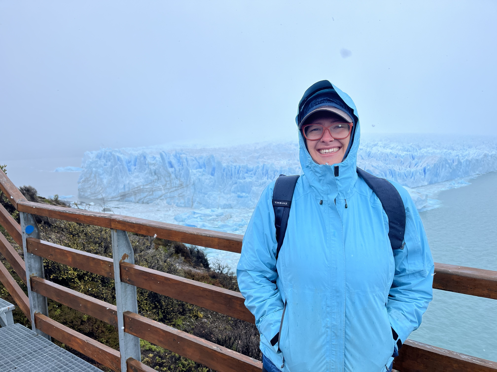

# hi, hei, hola

::::::: content-block
:::::: grid
:::: {.g-col-sm-5 .g-col-12}
{width="100%" fig-alt="Haley Daarstad"}

::: img-text
My name is Haley and I am a PhD Candidate in the political science department at [The University of California, Davis](https://ps.ucdavis.edu/).
:::

[<button type="button">Email</button>](mailto:hbdaarstad@ucdavis.edu) [<button type="button">CV</button>](https://www.dropbox.com/scl/fi/3pisr3lcd445rski28x2u/Curriculum-Vitae.pdf?rlkey=kxhewjckqcxvmctn7lnugzrrh&st=ayke7n6d&dl=0) [<button type="button">GitHub</button>](https://github.com/hbdaarstad)

::::

::: {.g-col-sm-7 .g-col-12 .text-block}

I study crime, violence, and gender. My work is broadly focused on understanding violence related to crime and its consequences and effects on behavior.

\
My dissertation is examining electoral and criminal violence and its gendered dimension, such as understanding how various forms of violence affect how women participate in the electoral process. I draw on causal inference, machine learning techniques, and qualitative interviews. I have received funding from the APSA Doctoral Dissertation Research Improvement Grant for my dissertation. Beyond my dissertation, I also research and have on going projects working on conflict, peace, and extralegal violence.

\
I was born and raised in California, and attended Oregon State University where I obtained a bachelors degree in Political Science and New Media Communications in 2021. In my free time, I enjoy riding my bike, skiing, and learning to play hockey. I am also a huge fan of Formula1 (papaya is my color). I also am a San Jose Sharks (#TheFutureIsTeal 🦈 ) and a Boston Fleet fan.

→ see my [***Research***](papers.qmd)
:::
::::::

\
:::::::

