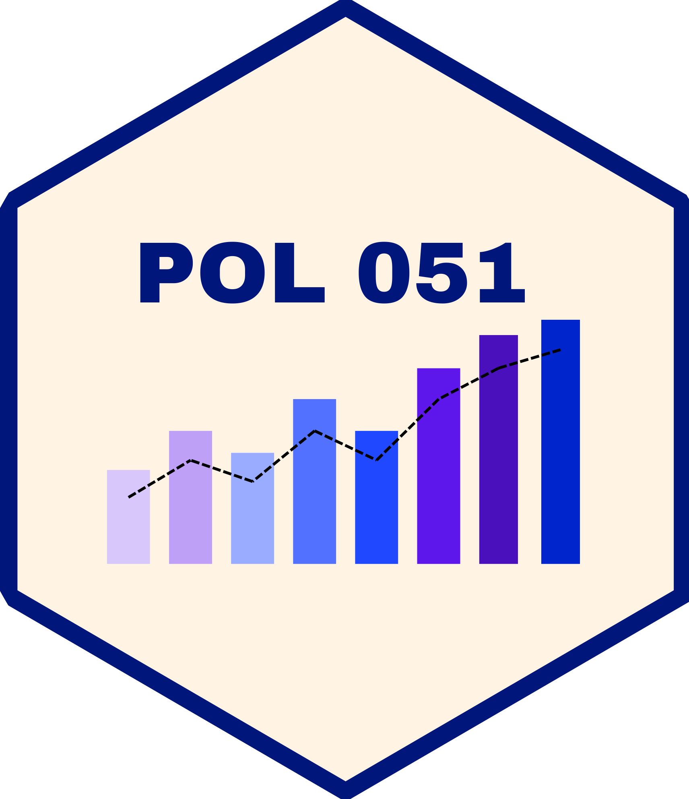
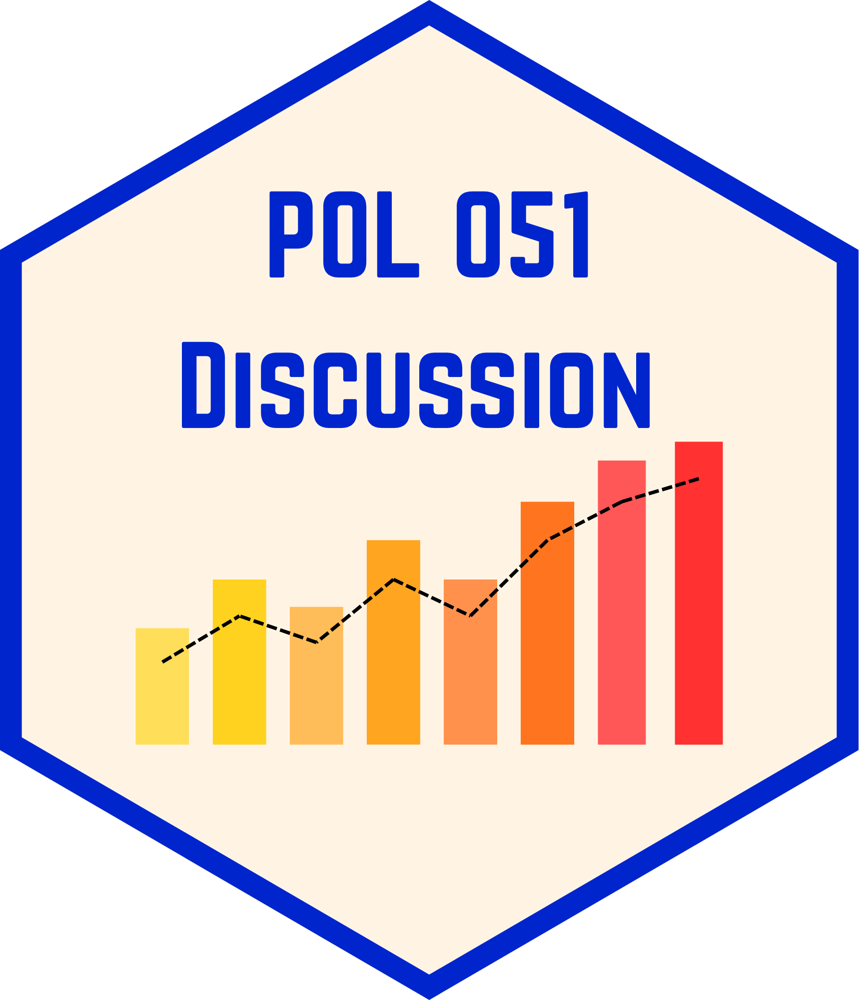

::: theme-filters
<button class="active" onclick="filterPubs(&#39;all&#39;, this)">All</button> <button onclick="filterPubs('lecturer', this)">Courses</button> <button
onclick="filterPubs('teaching-assistant', this)">Teaching Assistant</button> <button onclick="filterPubs('syllabus-examples', this)">Syllabus Examples</button>
:::

### Lecturer

::::::::: {.pub-item data-topics="lecturer"}
:::::::: course-card
::: course-meta
[Summer 2026]{.course-date} [Haley Daarstad]{.course-instructor}
:::

::::: course-content
::: course-title
<a href="https://haleydaarstad.com/pol051-su26/course-overview.html">The Scientific Study of Politics</a>
:::

::: course-tags
[Undergraduate]{.course-tag} [Methods]{.course-tag} [R]{.course-tag}
:::

<p class="course-desc">

Undergraduate political science methods course at UC Davis covering causal inference, data visualization, and R programming.

</p>

<p class="course-links">

<a href="https://haleydaarstad.com/pol051-su26/course-overview.html">Course website</a> · <a href="https://haleydaarstad.com/pol051-su26/course-syllabus.html">Syllabus</a>

</p>
:::::

::: course-image

:::
::::::::
:::::::::

### Graduate Teaching Assistant with Sections

::::::::: {.pub-item data-topics="teaching-assistant"}
:::::::: course-card
::: course-meta
[Fall 2026]{.course-date} [Haley Daarstad]{.course-instructor}
:::

::::: course-content
::: course-title
<a href="https://haleydaarstad.com/pol051-f26-section/course-overview.html">The Scientific Study of Politics (Discussion Sections)</a>
:::

::: course-tags
[Undergraduate]{.course-tag} [Methods]{.course-tag} [R]{.course-tag} [Section]{.course-tag}
:::

<p class="course-desc">

Discussion sections for POL 051 at UC Davis, where students work in smaller groups to clarify course material, practice data analysis in R, and build causal reasoning skills.

</p>

<p class="course-links">

<a href="https://haleydaarstad.com/pol051-f26-section/course-overview.html">Section website</a> · <a href="https://haleydaarstad.com/pol051-f26-section/course-syllabus.html">Syllabus</a>

</p>
:::::

::: course-image

:::
::::::::
:::::::::

::: {.pub-item data-topics="teaching-assistant"}
-   Intro to Comparative Politics, *Spring 2024; Fall 2025; Winter 2026*
-   The Scientific Study of Politics, *Fall 2023 – Spring 2025*

[Section Teaching Materials](https://github.com/hbdaarstad/POL-051-Teaching-Materials) for The Scientific Study of Politics on GitHub and a link to my [R for The Scientific Study of Politics](https://www.haleydaarstad.com/POL051.github.io/).
:::

------------------------------------------------------------------------

### Graduate Teaching Assistant without Sections

::: {.pub-item data-topics="teaching-assistant"}
-   Gender and Politics, *Spring 2026*
-   International Political Economy, *Winter 2022; Spring 2026*
-   Comparative Electoral Systems, *Winter 2025*
-   Political Psychology, *Fall 2024*
-   Russian Politics, *Winter 2024*
-   Intro to Political Modeling, *Spring 2023*
-   US Public Opinion, *Winter 2023*
-   British Politics, *Fall 2022*
-   Media and Politics, *Summer 2022*
-   Group Identity Politics, *Spring 2022*
:::

------------------------------------------------------------------------

### Syllabus Examples

::: {.pub-item data-topics="syllabus-examples"}
-   [Gender in the International Context](/syllabuses/genderIR_syllabus_daarstad.pdf){download="genderIR_syllabus_daarstad.pdf"}
-   [The Comparative Study of Contentious Politics](/syllabuses/cp_syllabus_daarstad.pdf){download="cp_syllabus_daarstad.pdf"}
-   [Organized Crime and Transnational Organizations](/syllabuses/tco_syllabus_daarstad.pdf){download="toc_syllabus_daarstad.pdf"}
:::

```{=html}
<script>
function filterPubs(topic, btn) {
  document.querySelectorAll('.theme-filters button').forEach(function(b) {
    b.classList.remove('active');
  });
  btn.classList.add('active');

  document.querySelectorAll('.pub-item').forEach(function(item) {
    const topics = (item.dataset.topics || '').split(' ');
    if (topic === 'all' || topics.includes(topic)) {
      item.classList.remove('pub-hidden');
    } else {
      item.classList.add('pub-hidden');
    }
  });

  // Hide/show each section heading + divider along with its items, so
  // headers for empty topics disappear instead of floating with nothing under them.
  document.querySelectorAll('section.level3').forEach(function(section) {
    const items = section.querySelectorAll('.pub-item');
    if (items.length === 0) {
      // Sections with no tagged items (e.g. Conferences) only show under "All".
      section.classList.toggle('pub-hidden', topic !== 'all');
    } else {
      const anyVisible = Array.prototype.some.call(items, function(item) {
        return !item.classList.contains('pub-hidden');
      });
      section.classList.toggle('pub-hidden', !anyVisible);
    }
  });
}
</script>
```
